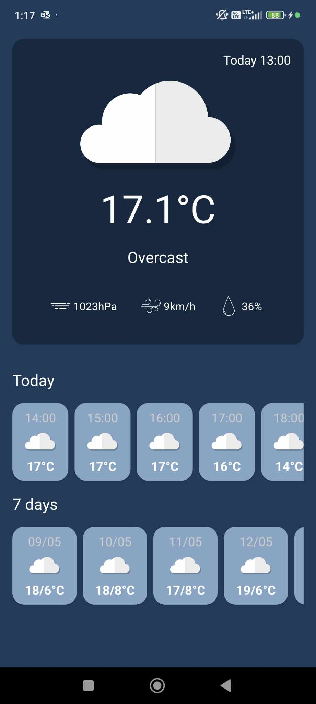

# WeatherForecast
Simple application in Kotlin that displays weather information based on users' current location.

This project was created from [this](https://www.youtube.com/watch?v=eAbKK7JNxCE&ab_channel=PhilippLackner) tutorial and then modified with certain fetures like: changing background color by clicking on "Today" and adding the 7 day forecast.  

    

